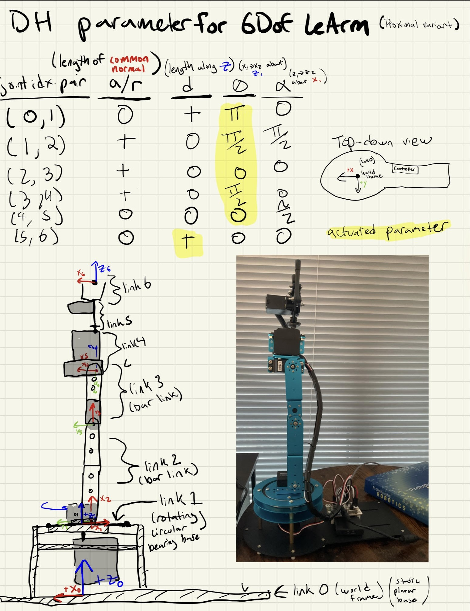

# LeArmKinematics
Python library for calculating / visualizing forward kinematics on the LeArm 6-DOF robotic arm.

You can find an amazon link to the arm [here](https://www.amazon.com/LewanSoul-Programmable-Feedback-Parameter-Programming/dp/B074T6DPKX)
and you can find python code for controlling joint positions [here](https://github.com/ccourson/xArmServoController)



# Getting Started
First, clone this git repo:

```bash
git clone https://github.com/eric-rosen/LeArmKinematics.git
```

Then, go into the directory, and the setup via pip (I suggest using a virtual environment like [conda](https://conda.io/projects/conda/en/latest/user-guide/getting-started.html)):

```bash
cd /PATH/TO/LeArmKinematics
pip install -e .
```

Then, you're done! You should now be able to import `learm` in python:

```python
import learm
```

Have fun :) 
# Python examples
The LeArm is a 6DoF robot arm, which means there are 6 joints that we can control (and therefore specify values for). 

For example, consider the following joint configuration:

```python
import numpy as np 

HOME_CONFIGURATION : list[float] = [np.pi,      # joint/servo 1 (radians)
                                    np.pi/2.0,  # joint/servo 2 (radians)
                                    0,          # joint/servo 3 (radians)
                                    np.pi/2.0,  # joint/servo 4 (radians)
                                    0,          # joint/servo 5 (radians)
                                    0.09]       # joint/servo 6 (meters)
```
This joint configuration represents the home configuration, which is when the robot is standing straight up with its gripper fully open. A funner position where the robot is bending over to grab something on the table might look like:

```python
GRAB_CONFIGURATION : list[float] = [np.pi,                  # joint/servo 1 (radians)
                                    np.pi/2.0 + np.pi/8.0,  # joint/servo 2 (radians)
                                    0 + np.pi/3.0,          # joint/servo 3 (radians)
                                    np.pi/2.0 + np.pi/3.0,  # joint/servo 4 (radians)
                                    0,                      # joint/servo 5 (radians)
                                    0.09 + 0.01]            # joint/servo 6 (meters)
```

Given a 6D joint configuration (like `HOME_CONFIGURATION`), forward kinematics calculates where each link is posed (position/orientation) in 3D space. 

For example, to calculate where each link of the arm is when it is in the home configuration, we can use the `get_link0_t_linki` function by passing it a configuration:

```python
from learm.kinematics import get_link0_t_linki

# Calculating forward kinematics to get the pose of each link in the HOME_CONFIGURATION
link0_t_linki_list : list = get_link0_t_linki(HOME_CONFIGURATION)
```

We use the notation `linki_t_linkj` to refer to the 3D pose/transform (`SE(3)` represented as 4x4 numpy matrix) of `linkj` in `linki`'s frame. So in this case:

```python
link0_t_link0 = link0_t_linki_list[0] # this is always identity matrix
link0_t_link1 = link0_t_linki_list[1] # link_1's pose in world frame based on given joint value
link0_t_link2 = link0_t_linki_list[2] # link_2's pose in world frame based on given joint value
## ...
link0_t_link6 = link0_t_linki_list[5] # link_6's pose in world frame based on given joint value
```

If we want, we can launch an interactive visualizer to see what the robot looks like in a given configuration configuration, and adjust
sliders to see what it would look like in other ones:

```python
from learm.visualization import InteractiveVisualizer

# launch interactive visualizer, by default it's in the HOME_CONFIGURATION
InteractiveVisualizer()
# you can also launch it with a specific starting joint configuration, for example:
InteractiveVisualizer(*GRAB_CONFIGURATION)
```

You should see something like this:


# Contributors
If you have any questions, feel free to reach out to [Eric Rosen](https://eric-rosen.github.io).
